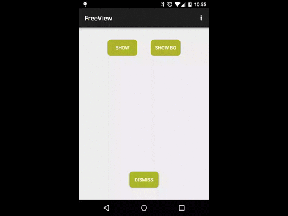

FreeView
=============

FreeView create a floating view that you can use and move inside your app and also when your app is in background.


Usage
-----

Add library to your build.gradle:

```java

	    compile 'com.jcmore2.freeview:freeview:1.1.2'

```

Add Window permission in your manifest:

```xml

    <uses-permission android:name="android.permission.SYSTEM_ALERT_WINDOW" />

```

Init FreeView with your content:

```java

    FreeView.init(MainActivity.this).withView(R.layout.content).showFreeView();

```




You can also use a callback:

```java

     FreeView.init(MainActivity.this).withView(R.layout.content).showFreeView(new FreeView.FreeViewListener() {
             @Override
              public void onShow() {
                   Toast.makeText(MainActivity.this, "onShow", Toast.LENGTH_SHORT).show();
              }

              @Override
              public void onDismiss() {
                   Toast.makeText(MainActivity.this, "onDismiss", Toast.LENGTH_SHORT).show();
              }

              @Override
              public void onClick() {
                    Toast.makeText(MainActivity.this, "onClick", Toast.LENGTH_SHORT).show();
              }
     });

```

Dismiss FreeView using:

```java

     FreeView.get().dismissFreeView();


```

If you want FreeView will show when your app goes to background use ``dismissOnBackground(false)``:

```java

     FreeView.init(MainActivity.this).withView(R.layout.content).dismissOnBackground(false).showFreeView(new FreeView.FreeViewListener() {
             @Override
             public void onShow() {
                  Toast.makeText(MainActivity.this, "onShow", Toast.LENGTH_SHORT).show();
             }

             @Override
             public void onDismiss() {
                  Toast.makeText(MainActivity.this, "onDismiss", Toast.LENGTH_SHORT).show();
             }
     });

```


You can check the sample App!

Credits & Contact
-----------------

FreeView was created by jcmore2@gmail.com


License
-------

FreeView is available under the Apache License, Version 2.0.
